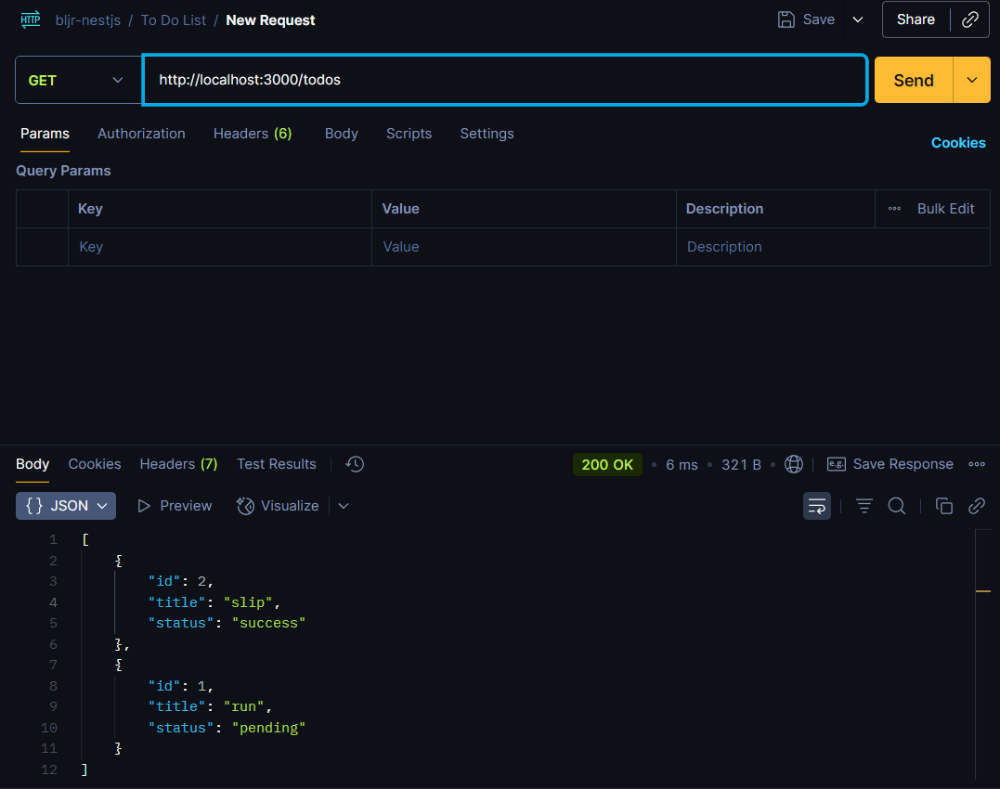
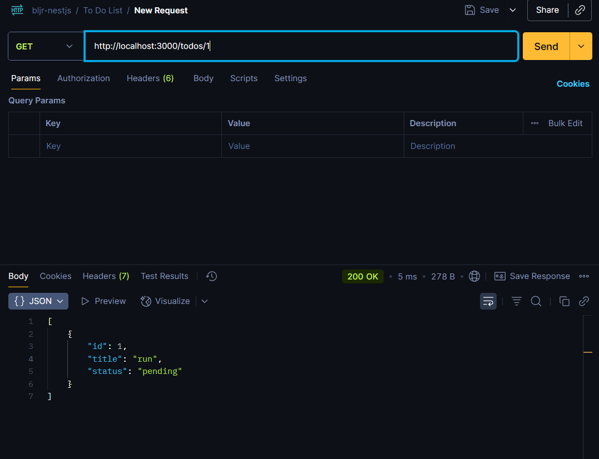
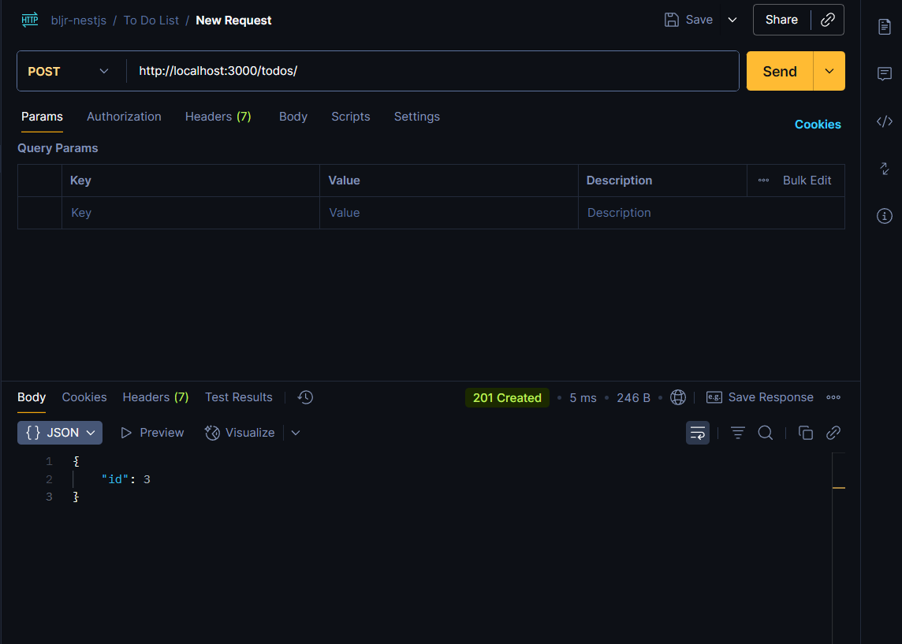
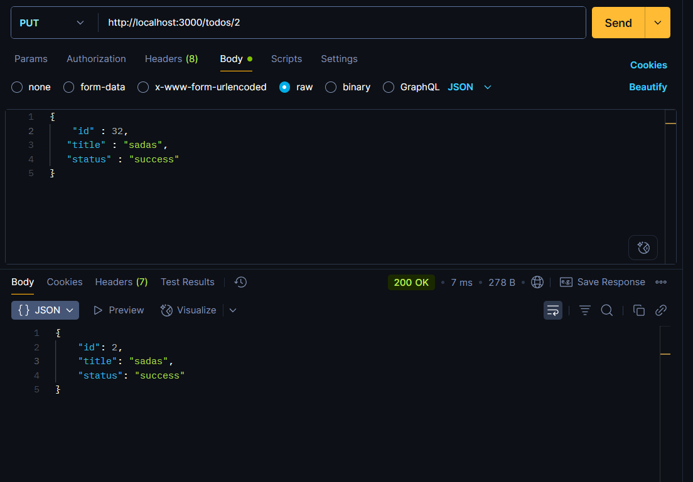

# 📌 Todo List

## 👤 Identitas

- Nama: Abhinaya Dwi Putra Mahardika
- Kelas: XIRPL1

---

## 📖 Deskripsi Singkat

Project ini adalah implementasi sederhana **controller Todo List** menggunakan **NestJS** tanpa database.  
Data todo disimpan langsung di dalam array pada service.

---

## 📂 Daftar EndPoint

- GET /todos → Menampilkan semua todo
- GET /todos/:id → Menampilkan todo berdasarkan ID
- POST /todos → Menambah todo baru
- PUT /todos/:id → Mengupdate todo berdasarkan ID
- DELETE /todos/:id → Menghapus todo berdasarkan ID

[Hasil Menghapus todo berdasarkan ID](./poto/5.png)
