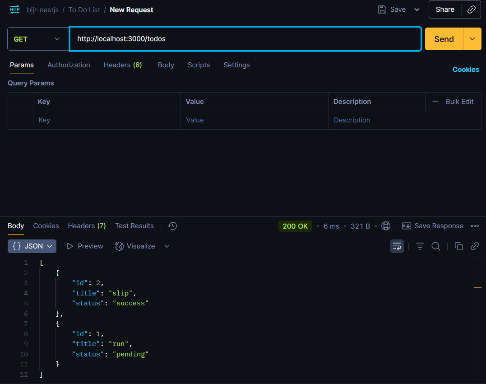
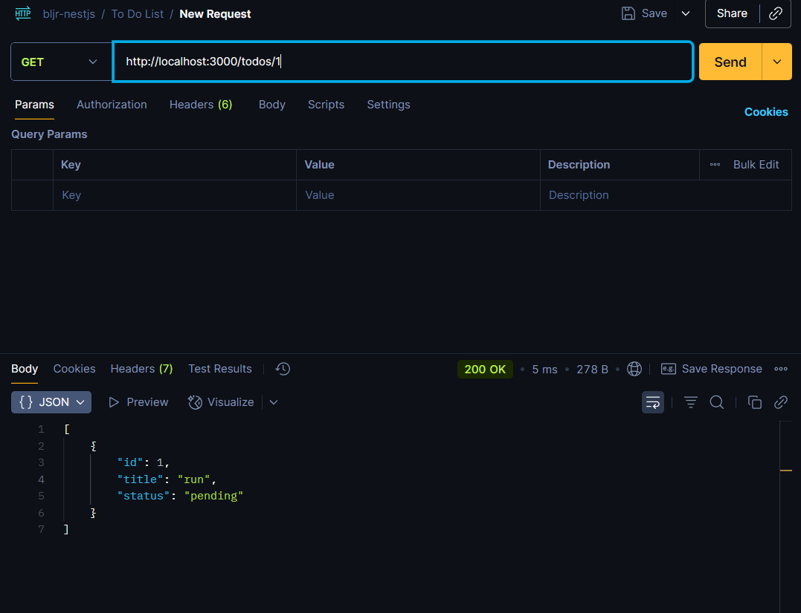
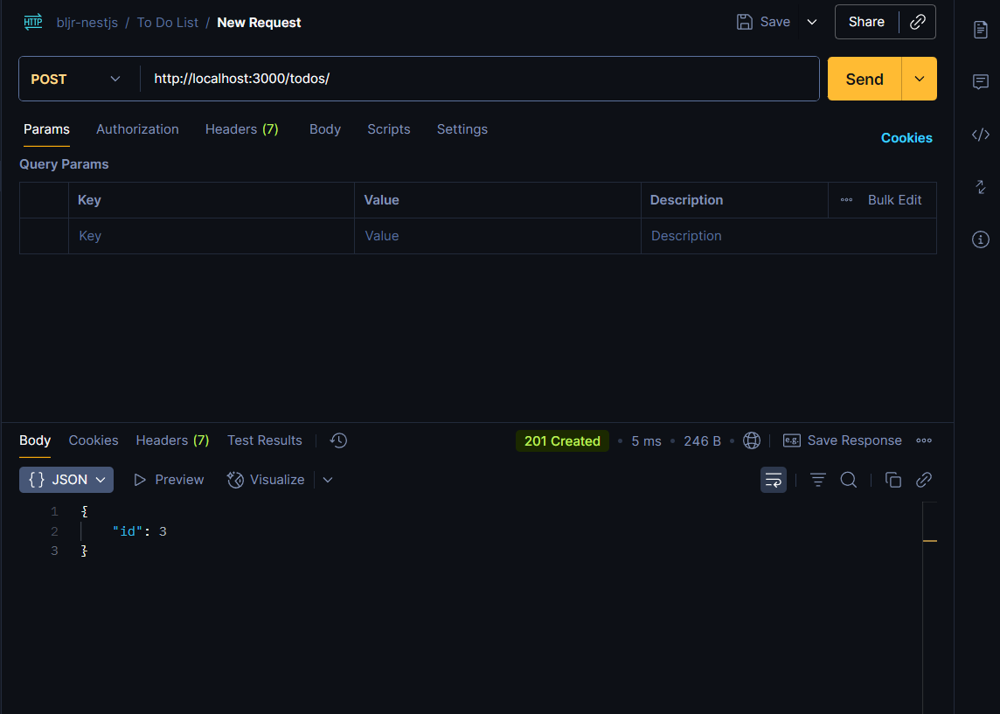
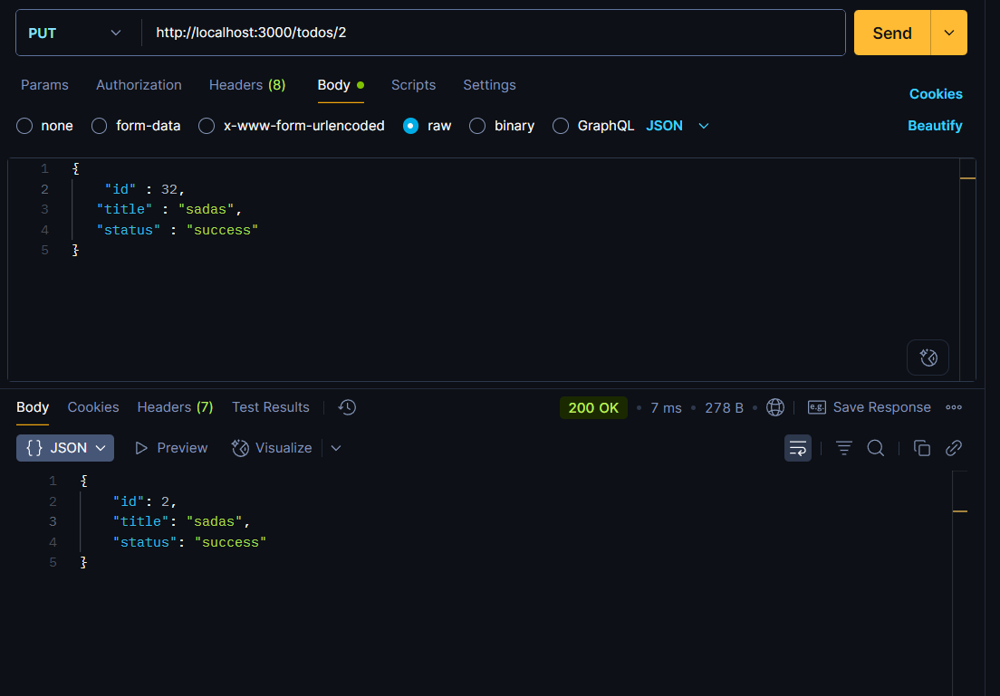

# 📌 Todo List

## 👤 Identitas

- Nama: Abhinaya Dwi Putra Mahardika
- Kelas: XIRPL1

---

## 📖 Deskripsi Singkat

Project ini adalah implementasi sederhana **controller Todo List** menggunakan **NestJS** tanpa database.  
Data todo disimpan langsung di dalam array pada service.

---

## 📂 Daftar EndPoint

- GET /todos → Menampilkan semua todo
- GET /todos/:id → Menampilkan todo berdasarkan ID
- POST /todos → Menambah todo baru
- PUT /todos/:id → Mengupdate todo berdasarkan ID
- DELETE /todos/:id → Menghapus todo berdasarkan ID





f



[Hasil Menghapus todo berdasarkan ID](./todolistphoto/5.png)


# 📚 CRUD Siswa

Project ini adalah implementasi sederhana CRUD (Create, Read, Update, Delete) menggunakan **NestJS**.  
Data `Siswa` disimpan sementara di dalam **array**, tanpa menggunakan database.

## 📂 Struktur Data

Setiap data siswa memiliki struktur:

```json
{
  "nisn": "string",
  "nama": "string",
  "alamat": "string",
  "umur": 0
}


